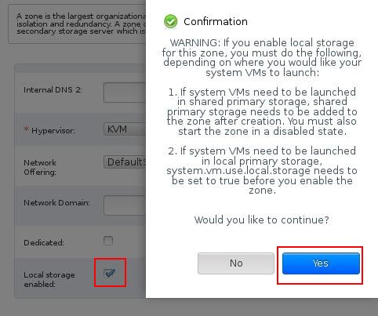

## 配置CloudStack
安装好Management节点和Agent节点后，我们可以在页面里配置CloudStack。    

首次登录到CloudStack管理页面时，你看到如下网页:    

   

点击 `Continue with basic installation`,设置密码:    

    

设置完毕后，刷新浏览器，用更改后的密码登录:    
  

选择"I have used CloudStack before, skip this guide"按钮，到达这个页面:    

   

### CloudStack Global Options
我们希望使用本地存储，所以通过下列设置来激活本地存储:    

点击 `Global Options`按钮， 输入`local`，搜索出相应结果:    
 
   

更改 `system.vm.usel`的值为 `true:    

    

重启Cloudstack-management 服务:    

```
# service cloudstack-management restart
```

### Infrasturcture 配置

点击 `Infrasturcture`, 现在是什么也没有被配置的状态:   

    

点击"Zone"下的"View All"按钮:    


点击"Add Zone"按钮:    

   

选择 Zone 类型:   
    

配置Zone信息:   

    

   

点击Next按钮，再点击一下，跳过第3步过程，进入到"4 Add Resources", 配置start/end IP范围:    

   

接着配置Guest Graffic:   

   

配置cluster名:  

    

添加host:   

   

添加二级存储:   

   


点击 Launch , 你可以看到zone/pod被创建，host被添加进cluster. 

   

因为我们前面启用了本地存储，因而在Service Offering的选项中我们也需要提供出对应
本地存储的相关配置:    

点击Service Offerings -> Add compute offering:   

    

现在可以删除我们不需要的Compute Offering, 默认增加的Service Offering都是针对共
享存储的，可以直接删除掉。     

    

点击下拉列表里的Disk Offerings:    

   

现在看到的套餐配置如下:    

   

在这里添加针对本地存储的选项:    

    

删除掉不需要的共享存储的选项后，最终的列表如下:    

   

